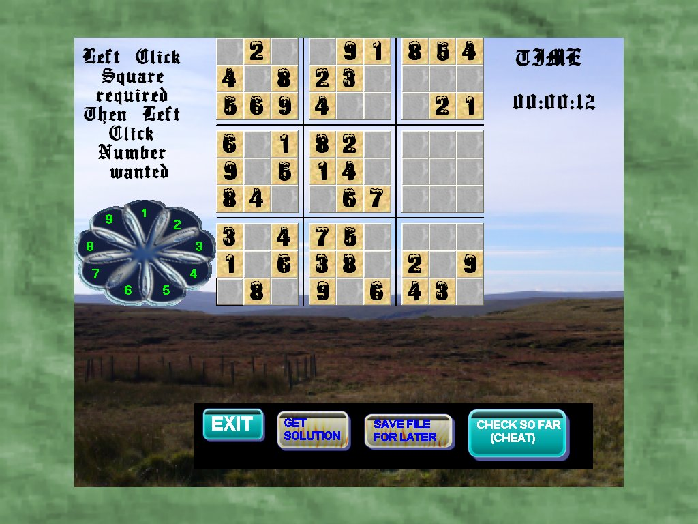

<div align="center">

## sweeney


</div>

### Description

create a sudoku puzzle then solve it

This is an updated version of my previous sudoku, having extra features and graphics.

My apoligies to anyone missing mouseover. This module got left behind in my work area.
 
### More Info
 


<span>             |<span>
---                |---
**Submitted On**   |2007-02-15 16:56:20
**By**             |[Keith Todd](https://github.com/Planet-Source-Code/PSCIndex/blob/master/ByAuthor/keith-todd.md)
**Level**          |Intermediate
**User Rating**    |5.0 (10 globes from 2 users)
**Compatibility**  |VB 6\.0
**Category**       |[Games](https://github.com/Planet-Source-Code/PSCIndex/blob/master/ByCategory/games__1-38.md)
**World**          |[Visual Basic](https://github.com/Planet-Source-Code/PSCIndex/blob/master/ByWorld/visual-basic.md)
**Archive File**   |[sweeney2048232172007\.zip](https://github.com/Planet-Source-Code/keith-todd-sweeney__1-67863/archive/master.zip)

### API Declarations

```
Mouse
Cursor
Elliptical
```


